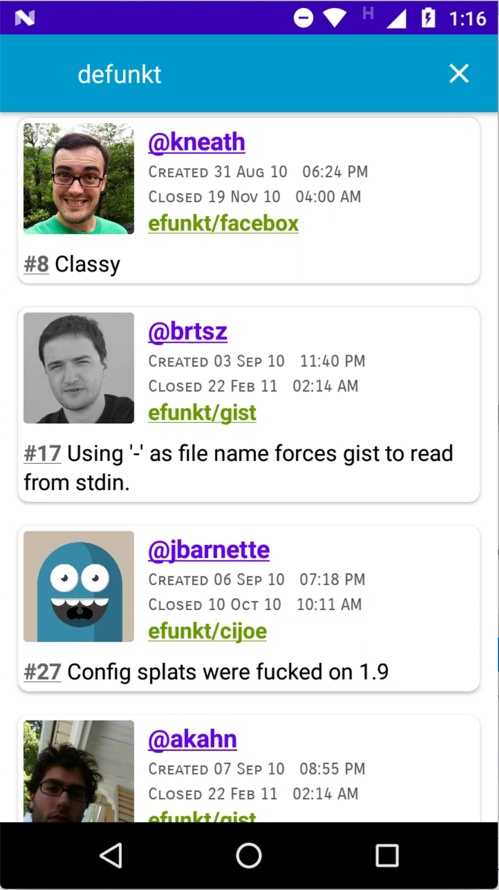
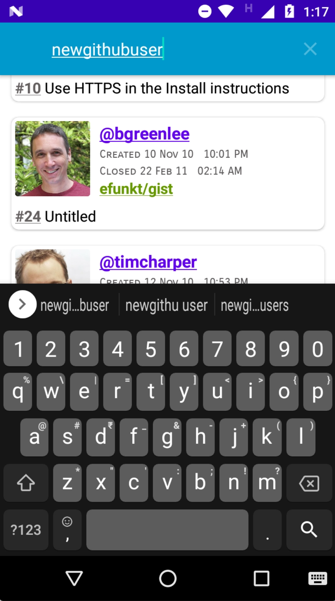

  

 

Demo/practise app: mvvm, picasso, retrofit, recyclerview, pagination, kotlin etc

todo (for later; not part of this demo target):

- [] handle that case when someone keeps loading hundreds of items in the recycler view
- [] user suggestion on no user match
- [] autocomplete when typing username
- [] ask for a user name on first launch, also provide suggestions for trending users
- [] handle both users and orgs for closed pull request search
- [] offer filter to show both closed and open pull requests